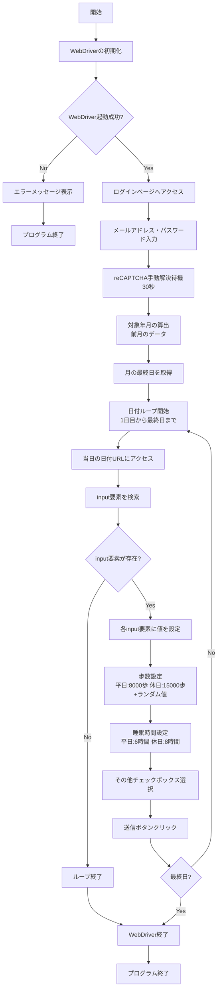

# ppup
automate keeping records

# 前提
以下を準備してください。

## 必要環境
- Python 3.10 以上推奨
- pip (Python パッケージ管理ツール)

## 必要ライブラリ
ppup.py は以下のライブラリをインストールした仮想環境上で動作を確認しています。
```
attrs==25.3.0
certifi==2025.7.9
cffi==1.17.1
h11==0.16.0
idna==3.10
outcome==1.3.0.post0
pycparser==2.22
python-dotenv==1.0.1
PySocks==1.7.1
selenium==4.34.2
sniffio==1.3.1
sortedcontainers==2.4.0
trio==0.30.0
trio-websocket==0.12.2
typing_extensions==4.14.1
urllib3==2.5.0
websocket-client==1.8.0
wsproto==1.2.0
```

仮想環境の準備:
```bash
# 仮想環境の作成
python -m venv venv

# 仮想環境の有効化
# Windows の場合:
venv\Scripts\activate
# macOS/Linux の場合:
source venv/bin/activate

# 必要ライブラリのインストール
pip install -r requirements.txt
```

## WebDriver の準備
Selenium を利用する場合、使用するブラウザに対応した WebDriver を事前にダウンロードしてください。
- Chrome: https://googlechromelabs.github.io/chrome-for-testing/
- Edge: https://developer.microsoft.com/en-us/microsoft-edge/tools/webdriver/
- Firefox (GeckoDriver): https://github.com/mozilla/geckodriver/releases

配置方法:
ダウンロードした実行ファイル (Edgeの場合は msedgedriver.exe) を ppup.py と同じディレクトリに配置してください。

Edge の例:
```
ppup/
├── ppup.py
├── msedgedriver.exe  ← ここに配置
└── requirements.txt
```

バージョン不整合エラーが出る場合は、ブラウザのバージョンに合わせて再度 WebDriver を取得してください。

**注意事項:**
- WebDriver は定期的に更新されるため、ローカルの WebDriver が古くなっていることがあります。エラーが発生した場合は最新版をダウンロードしてください。
- 2段階認証方式や reCAPTCHA が導入されているため、WebDriver が認証画面を開いたら手動で認証を完了する必要があります。認証したらその後の画面はWebDriverが引き続き操作します。

## 使い方

## 処理の流れ



## 実行コマンド
```bash
# 仮想環境を有効化してから実行
python ppup.py
```
